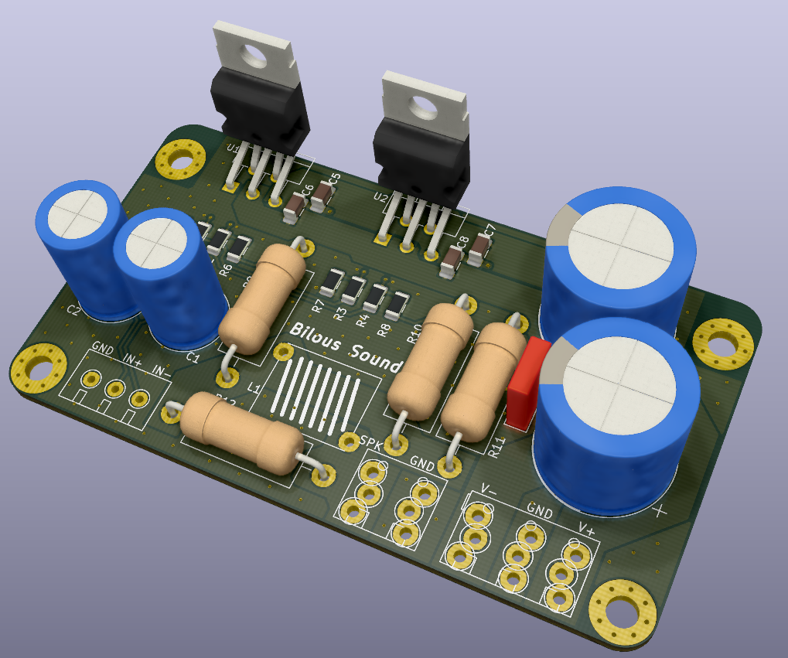
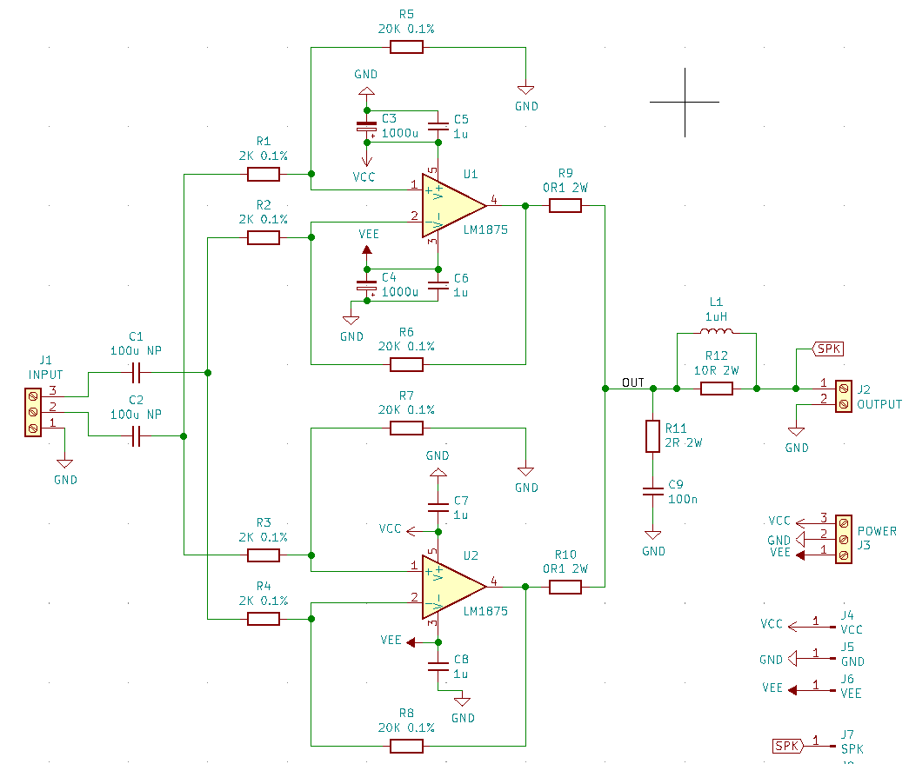
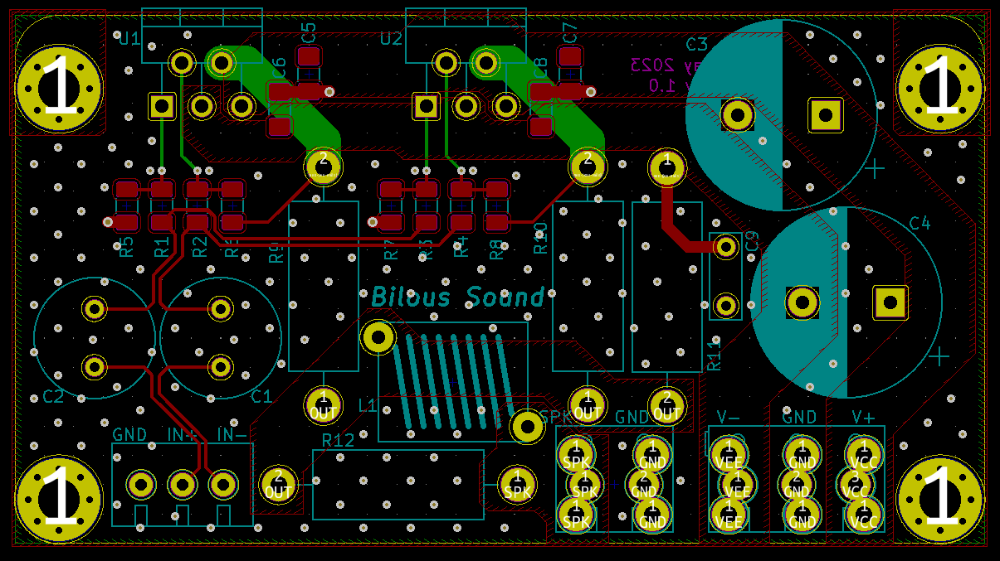

# TDA7293x2_bal_THT_SMD_1206
Two parallel TDA7293 chip amplifiers schematics and PCB layout design.

## PCB rendered in 3d:

## Schematics:

Two paralleled TDA7293 are used to double the current drive and to increase the power output. Safe voltage to power the amplifier is 36V.
Gain is set to a minimum recommended in the datasheet of 15 V/V.

## PCB layout:

Bottom layer is GND. Top layer is signal + power and GND poured in between. Stiching vias are then applied to connect bottom and top GND planes to ensure those are as close to 0 as possible.

