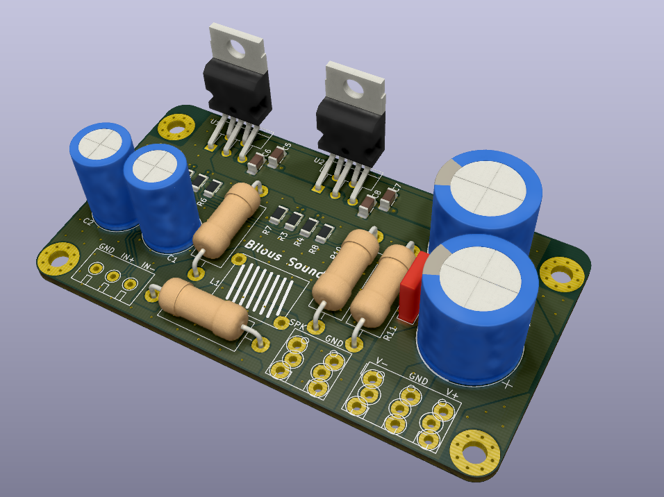

# Two paralleled LM1875 ICs schematics and PCB design

Benefits of using two chips in parallel include: increase of the output drive capability of an amplifier, reduced voltage noise (better SNR), and reduced output offset error.

Resources used to design this amp:

Official datasheet - [https://www.ti.com/lit/gpn/lm1875](https://www.ti.com/lit/gpn/lm1875)

Official datasheet for dual chip - [https://www.ti.com/lit/gpn/LM1876](https://www.ti.com/lit/gpn/LM1876)

## PCB rendered in 3d:

## Schematics:

Two paralleled LM1875 are used to double the current drive and to increase the power output. Safe voltage to power the amplifier is 28V.
Gain is set to a minimum recommended in the datasheet of 10 V/V.

## PCB layout:

Bottom layer is GND. Top layer is signal + power and GND poured in between. Stiching vias are then applied to connect bottom and top GND planes to ensure those are as close to 0 as possible.

